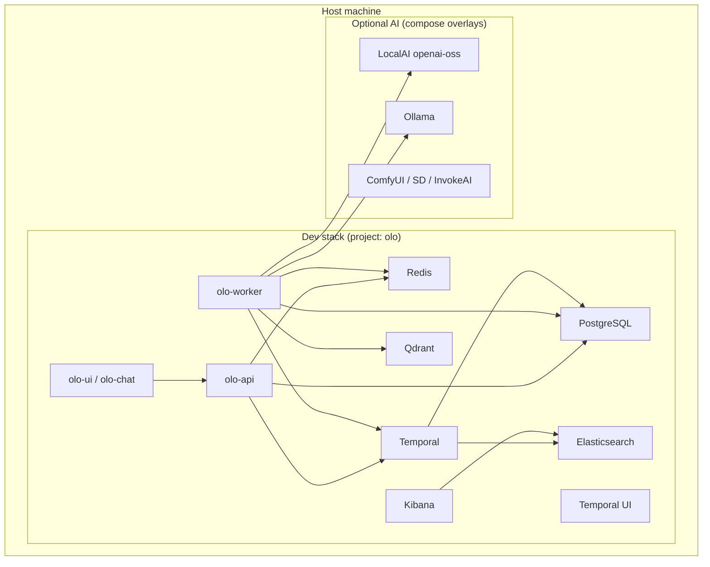

# Architecture

This repository runs the **OLO (Open LLM Orchestrator)** stack and optional **open-source AI** backends (text, speech, image, video) using Docker Compose. Everything shares one external Docker network: **`olo-net`**.

## High-level picture

- **Core (always in dev install):** database, cache, search, vector DB, workflow engine, and OLO application services.
- **AI (optional overlays):** extra compose files add GPU-backed inference containers; the OLO worker is configured to reach Ollama and Qdrant by **internal DNS names** on `olo-net`.

## Network model

- **`olo-net`** is created once (by install scripts if missing) and marked **`external: true`** in compose files so every stack file joins the same bridge network.
- **Service names** (e.g. `redis`, `db`, `temporal`, `qdrant`, `ollama`) are the hostnames containers use. **Host port mappings** (left side of `host:container`) are only for browsers and CLI tools on your machine.

## Dev stack layers

1. **Persistence & infra**
   - **PostgreSQL** (`db`): app data, Temporal DB usage, pgAdmin for admin UI.
   - **Redis** (`redis`): caching / queues as configured by OLO.
   - **Elasticsearch + Kibana**: used by Temporal setup and observability-style UIs.
   - **Qdrant** (`qdrant`): vector store for RAG-style flows.

2. **Orchestration**
   - **Temporal** (`temporal`): durable workflows; worker connects with `TEMPORAL_HOST=temporal:7233`.
   - **Temporal UI** (`temporal-ui`): web UI for workflows (mapped to a high host port to reduce clashes).

3. **OLO application**
   - **olo** (`olo`): HTTP API on container port `7080`.
   - **olo-worker**: consumes Temporal tasks; reads config from mounted files under `dev/configuration/olo-worker/`.
   - **olo-ui**, **olo-chat**: web frontends; talk to API via env such as `OLO_API_BASE_URL` (see compose).

4. **AI (optional)**
   - **Text:** LocalAI (`openai-oss` service) + Ollama — OpenAI-compatible and local model runners.
   - **Speech:** separate compose can add another LocalAI + Ollama pair; service names may duplicate across files — **last loaded compose file wins** for that service name, so enable only what you need.
   - **Image / video:** ComfyUI, Stable Diffusion WebUI, InvokeAI — GPU images; heavy disk for models.

## Request flow (simplified)

1. User or client hits **OLO API** or **UI** on mapped host ports.
2. API/worker uses **Redis**, **Postgres**, **Temporal**, **Qdrant** as configured.
3. For LLM calls, worker uses **internal URLs** (e.g. `http://ollama:11434`) — not `localhost` — unless env explicitly sets localhost for callbacks from the host.

## Prod vs demo vs dev

| Aspect | dev | demo | prod |
|--------|-----|------|------|
| Scope | Full platform + optional AI | Sample app + DB | App + DB |
| DB on host | Yes (high port) | Yes | No |
| AI stacks | Optional compose overlays | No | No |

Prod and demo use placeholder **`your-app:latest`** until you substitute your application image.

## Port strategy (host)

Host ports are chosen in the **high range** to reduce conflicts with common local services (3000, 5432, 8080, etc.). If Windows reserves a range, you may need to change a mapping in the relevant compose file — see [Reference — troubleshooting](reference.md#port-conflicts-on-windows).
